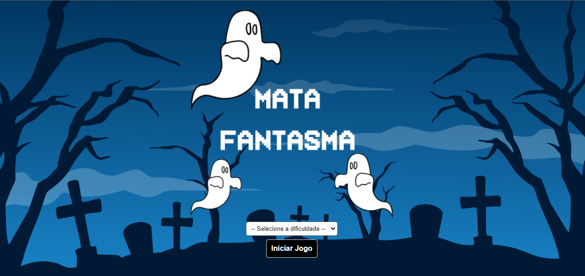
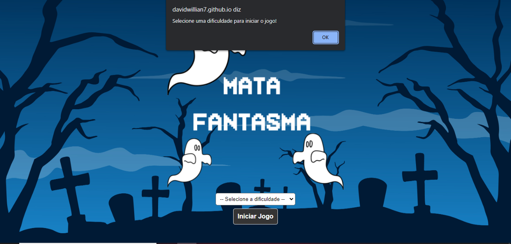
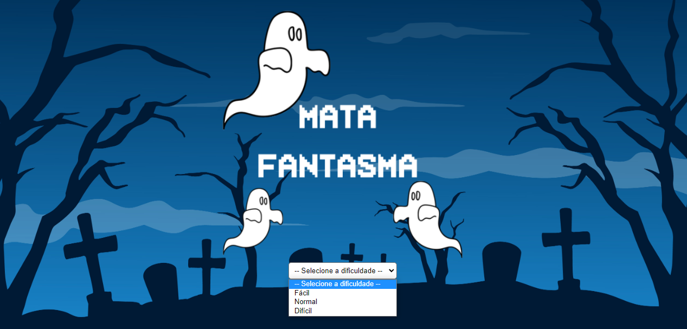
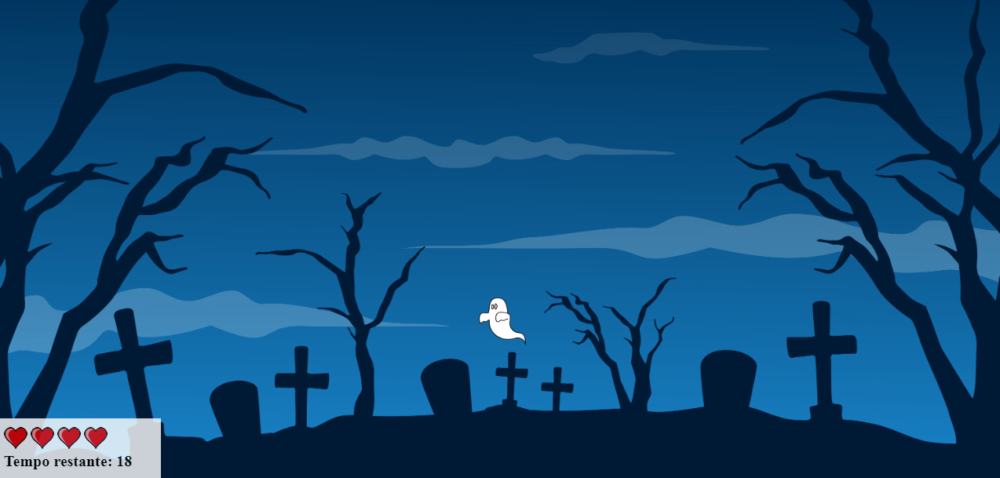
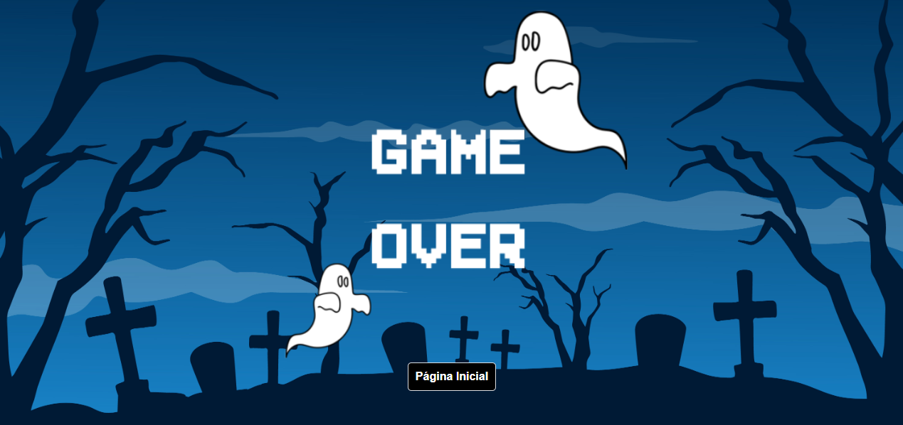
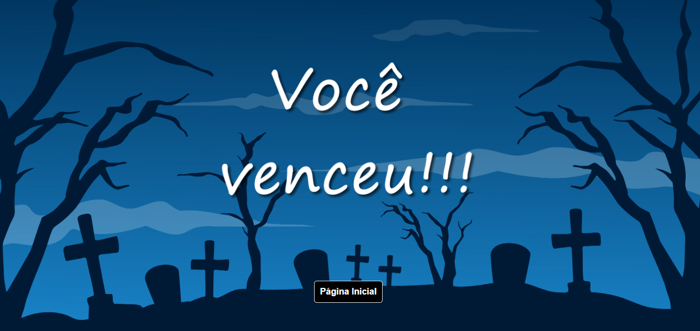

# Mata-Fantasma

O desafio consiste em criar um jogo que cria um inimigo com tamanhos diferentes em um local aleatório da tela, além de se adaptar a diferentes tamanhos de tela, e caso o usuário não mate o inimigo clicando nele o inimigo desaparece resultando na perca de um coração de vida do jogador, para vencer basta que o jogador fique 20 segundos matando o inimigo.

## 🔧 Funçoes 

### Iniciar Jogo:
Para iniciar o jogo é necessário que o usuário selecione uma dificuldade, caso nenhuma dificuldade seja selecionada aparece um aviso solicitando que o jogador escolha uma dificuldade.

### Dificuldades:
O jogo conta com três dificuldades, sendo elas respectivamente, fácil, normal e difícil. No fácil o inimigo fica mais tempo na tela para que o jogador consiga clicar e matar o inimigo, no normal o inimigo começa a desaparecer mais rápido e no difícil o inimigo desaparece muito rápido.

### Tela de jogo:
A tela de jogo conta com um painel, no canto inferior esquerdo, que contém os corações de vida do jogador e o tempo restante em segundos para o jogador vencer, quando o inimigo desaparece e o jogador não o mata o coração fica vazio.

### Game Over:
Quando todos os corações de vida do jogador ficam vazios é exibida a tela de fim de jogo.

### Congratulation
Quando o tempo restante chegar a zero é exibida a tela de vitória.

## Feito Com:

Copyright © DavidWillian

